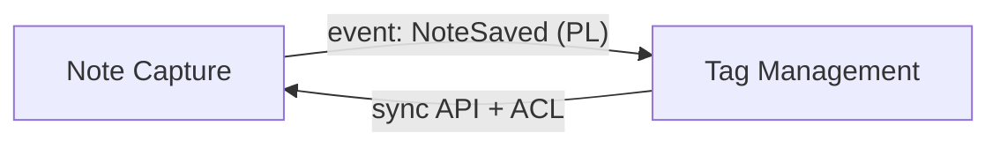

ユーザが `/ori-ddd-4-context-map` を呼んだ際、distill-ddd Phase 4（Context Map）を ori convention 注入版で実行します。**bounded context 間の戦略的関係**を確定し、Mermaid 図と表で記録します。

## 役割

- **ファシリテーター**：context 間の依存方向と統合パターンを質問で引き出す
- **挑戦者**：「ACL は必要か」「SharedKernel は本当に共有可能か」を問う
- **記録係**：表 + Mermaid 図の両方で表現

## 入力 / 出力

- 入力：`.ori/domain/bounded-contexts.md`（Phase 3）
- 出力：`.ori/domain/context-map.md`
  - frontmatter: `ori:` ブロック（design.md §5）
    - `node_id: context-map:map`
    - `type: context-map`
    - `depends_on: [bounded-context:collection]`
  - 個別 `relationship:<from>-to-<to>` node は H3 anchor から resolve（例: `### Note Capture → Tag Management {#note-capture-to-tag-management}`）
  - 関係表 + Mermaid `graph LR` 図

## 統合パターン（DDD 戦略パターン）

| パターン | 関係 |
|----------|-----|
| Upstream / Downstream (U/D) | 一方向依存 |
| Customer / Supplier | 公式な顧客-供給者契約 |
| Conformist | downstream が upstream のモデルに従う |
| Anti-Corruption Layer (ACL) | downstream で変換層を挟む |
| Open Host Service (OHS) | upstream が公開 API を提供 |
| Published Language (PL) | OHS の通信プロトコル |
| Shared Kernel | 双方で共有モデル（リスク高） |
| Separate Ways | 統合しない |
| Partnership | 相互依存（運命共同体） |
| Big Ball of Mud | レガシー封じ込め |

## 手順

1. **前提確認**：Phase 3 の bounded contexts を読み返す
2. **関係の列挙**：context A → context B の関係を 1 行ずつ
3. **各関係について対話**（必須項目）：
   - **方向**（A → B, B → A, 双方向）
   - **パターン**（上記の戦略パターンから 1 つ）
   - **連携手段**（同期 API / domain event / file / 直接 DB / etc.）
   - **保護**（ACL 配置場所、PL 仕様参照先）
4. **挑戦質問**：
   - 「双方向依存は本当に必要？ 片側で対応できないか」
   - 「ACL なしで integration して context 汚染しないか」
   - 「SharedKernel は維持コストに見合うか」
5. **Mermaid 図の生成**：
   ```mermaid
   graph LR
     NC[Note Capture]
     TM[Tag Management]
     NC -- "event: NoteSaved (PL)" --> TM
     TM -- "ACL" --> NC
   ```
6. `bash scripts/lint-domain.sh .ori/domain/context-map.md` を実行して自己検証
7. lint 失敗時は **1 回だけ** 自動修正、それでもダメなら人間判断

## 出力テンプレート

```markdown
---
ori:
  node_id: context-map:map
  type: context-map
  depends_on:
    - bounded-context:collection
---

# Context Map {#context-map}

## Relationships {#relationships}

| from | to | pattern | mechanism | notes |
|------|-----|---------|-----------|-------|
| Note Capture | Tag Management | U/D + PL | `NoteSaved` event | OHS on Note Capture side |
| Tag Management | Note Capture | ACL | sync API | translate Tag VO at boundary |

## Diagram {#diagram}



## Decisions {#decisions}

- Note Capture が upstream。Tag Management は conformist にせず ACL を入れる（Tag の正規化ルールを context 内で完結させたい）
- SharedKernel は採用しない（運用負荷大）

## Open Questions {#open-questions}

- event の delivery guarantee は at-least-once でよいか
```

## 注意

- **Mermaid 図と表は冗長でも両方書く**：図 = 全体像、表 = 検索可能な事実
- **SharedKernel は最後の手段**：維持コストを過小評価しない
- **このスキルは workflow を回さない**

## 次のアクション

Phase 4 完了後、ユーザに以下を提示：

- **通常パス**：`/ori-ddd-5-aggregates` — 各 context 内の aggregate を設計
- **戻る**：関係が決まらない場合は `/ori-ddd-3-bounded-contexts` で context 境界を見直し
- **早期切上げパス**：単一 context のみなら最初から Phase 4 はスキップ可（Phase 3 で完結）
