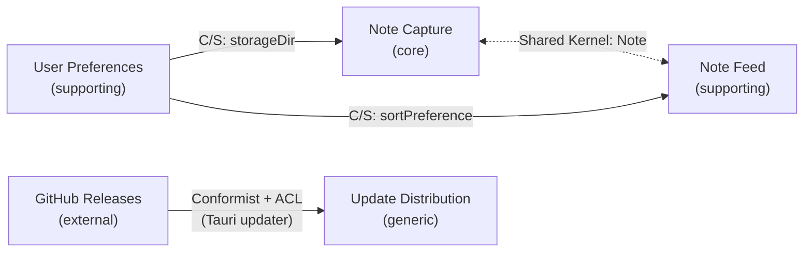

---
coherence:
  source: human
  last_validated: 2026-06-20
  upstream:
    - bounded-contexts.md
---

# Context Map {#context-map}

Phase 3 で確定した 4 BC（Note Capture / Note Feed / User Preferences / Update Distribution）
間の戦略的関係を整理する。単一バイナリ・単一開発者という前提により
重量級の統合パターン（OHS / PL with versioning など）は採用しない。

## Relationships {#relationships}

| from | to | pattern | mechanism | notes |
|------|-----|---------|-----------|-------|
| Note Capture | Note Feed | Shared Kernel | プロセス内で Note 型を直接共有 | Phase 3 で予告済み。spec で frontmatter 形式が固定のため共有コスト最小 |
| Note Feed | Note Capture | Shared Kernel | 同上（双方向） | Feed から Capture を起動するインプレース編集動線 |
| User Preferences | Note Capture | Customer-Supplier | 起動時に `storageDir` を DI 注入 | ACL 不要（`PathBuf` のみ受け渡し） |
| User Preferences | Note Feed | Customer-Supplier | 起動時に `sortPreference` を DI 注入 | フィルター・検索は復元しない（Q3 決定） |
| GitHub Releases (external) | Update Distribution | Conformist + ACL | Tauri v2 updater plugin (HTTP) | updater plugin 自体が ACL を兼ねる |
| Update Distribution | (なし) | Separate Ways | - | 他 BC から参照されない。アプリ起動時通知のみ |

## Diagram {#diagram}

## Decisions {#decisions}

### Note Capture と Note Feed = Shared Kernel {#decisions-shared-kernel}

- **採用理由**:
  - 単一プロセス・単一開発者のため「両 BC の合意形成コスト」が事実上ゼロ
  - Note の frontmatter 形式は spec 末尾で固定（`tags` / `createdAt` / `updatedAt`）
  - 別モデル化すると Capture → Feed の変換が毎回必要で無駄
- **管理単位**: Note Aggregate（body + frontmatter + filename）
- **変更ルール**: Note 構造を変える PR は両 BC の文書（aggregates.md）を同時に更新する義務を負う
- **将来の格上げ**: チームが複数になる、または別言語ランタイムを跨ぐ場合は
  Open Host Service + Published Language に移行を検討

### User Preferences から他 BC へ = Customer-Supplier (ACL なし) {#decisions-customer-supplier}

- Settings は **プリミティブ型 / VO 1 つ** のみを供給するため ACL 不要
  - `storageDir`: `PathBuf`
  - `sortPreference`: `SortPreference` VO (`createdAt|updatedAt × asc|desc`)
- Note Capture / Note Feed は Settings の内部構造を知らない。
  起動時に DI でこれら値を受け取るだけ
- 設定変更の伝搬:
  - `storageDir` 変更 → 再起動を要求する想定（リアルタイム反映不要）
  - `theme` 変更 → UI 層のみが購読（Note Capture / Feed は無関係）
  - `sortPreference` 変更 → Note Feed が即時反映 + 永続化

### Update Distribution = Conformist + ACL {#decisions-update-distribution}

- Tauri v2 updater plugin が GitHub Releases API スキーマを `UpdateChannel`
  domain object に変換する。**plugin 自体が ACL** として機能
- Conformist 側の判断: PromptNotes 側はスキーマ変更に追従するだけ（独自の変換ロジックを書かない）
- 他 BC から `UpdateChannel` を参照しない（**Separate Ways**）。
  起動時通知だけが副作用

### 採用しなかったパターン {#decisions-rejected}

- **OHS / PL**: 単一プロセスのため API 公開不要
- **Partnership**: BC 間に「共倒れする運命共同体」はない
- **Big Ball of Mud**: レガシー封じ込めの対象なし
- **Anti-Corruption Layer (Note と Settings 間)**: 受け渡し型が単純すぎて層を挟む価値なし

## Open Questions {#open-questions}

Phase 4 時点で未決事項はない。

- Phase 5 (aggregates) で Note 構造を確定する際、Shared Kernel の合意ルール
  （両 BC 同時更新義務）を `aggregates.md` の各 H2 配下に明示する
- Phase 6 (domain-events) で「Settings 変更が他 BC に伝わるか」を再検討する余地はあるが、
  現状は「再起動 / DI 注入」で十分という判断

## Notes {#notes}

- **Shared Kernel の判断は単独開発者前提に強く依存する**:
  もしチームが増えたら最初に見直すべき関係はここ。
  Note 構造の合意プロセスが暗黙になりやすい
- **mermaid で Shared Kernel を点線双方向矢印で表現**:
  Customer-Supplier の実線片方向矢印と区別するため
- **subdomain 投資配分の再確認**:
  core (Note Capture) を中心とした BC 配置になっており、generic (Update Distribution)
  は他 BC から完全に切り離されている。これは健全な配置
