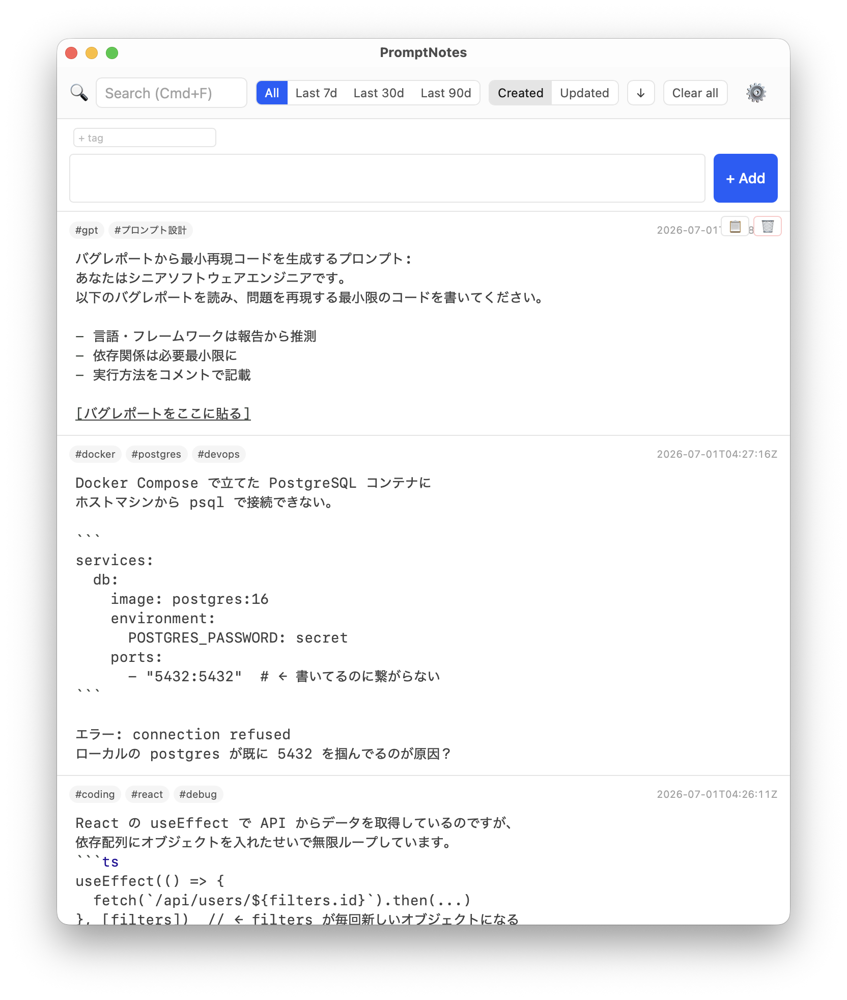
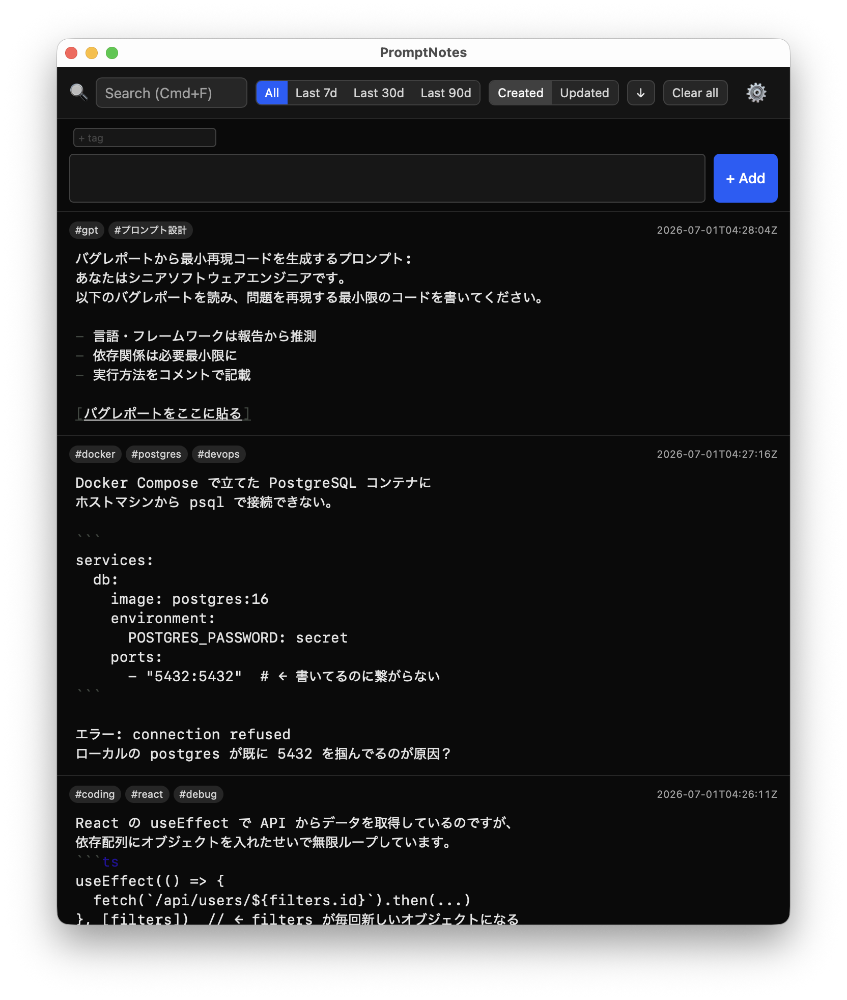

# promptnotes

AI プロンプトを書き溜め、すぐコピーして使うためのデスクトップノートアプリ。
プロンプトを書き溜めておく場所。

> Claude Code や Codex で Enter を押して意図せず送信してしまったことはありませんか？
> Prompt Notes なら、安心して Enter を押せます。

シングルペイン・CodeMirror 常時表示・markdown を `.md` ファイルとしてローカル保存。
Tauri v2 / SvelteKit / Rust 製。

> 構想の詳細は [idea.md](./idea.md)、ドメインモデルは [.ori/domain/](./.ori/domain/) を参照。

---

## スクリーンショット

<p align="center">
  
  
</p>

---

## なぜ Prompt Notes なのか

Claude Code や Codex CLI では、プロンプト入力中に Enter を押すと即座に AI へ送信されてしまいます。
書きかけのプロンプトをうっかり送信してしまった経験はありませんか？

Prompt Notes は **AI に送る前のプロンプトを書くための専用エディタ** です。
Enter は安心して改行に使えます。送信は `Cmd+Enter`（または `Ctrl+Enter`）。

また、すべてのノートはローカルの `.md` ファイルとして保存されるため、
他のツールと共存でき、データの持ち出しも自由です。

---

## 主な機能

- **Markdown 編集**: CodeMirror 6 によるシンタックスハイライト、リスト補完、ブラケット補完
- **全文検索**: 本文・タグをリアルタイム検索。`Cmd+F` / `Ctrl+F` で即フォーカス
- **タグ管理**: frontmatter でタグを管理、クリックでフィルタリング
- **ワンクリックコピー**: 本文のみをクリップボードにコピー（frontmatter・タグは除外）
- **自動保存**: キー入力後 500ms のデバウンスで `.md` ファイルとして自動保存
- **フィルター・ソート**: 期間フィルター（7日・30日・90日・すべて）、作成日／更新日ソート

---

## インストール

[GitHub Releases](https://github.com/dev-komenzar/promptnotes/releases) からダウンロードしてください。

| platform | 形式 | 備考 |
|---|---|---|
| macOS | `.app` / `.dmg` | Homebrew 対応も検討中 |
| Linux | `.deb` / `.rpm` / AppImage | Nix packages, Flatpak など対応拡充中 |

### macOS での起動

promptnotes は Apple Developer Program に登録していないため、公証 (notarization) されていません。
初回起動時に Gatekeeper の警告が出ます。以下のいずれかで回避してください。

**方法 A: 右クリックで開く**
1. Finder で `promptnotes.app` を右クリック（control + クリック）
2. 「開く」を選択
3. 再度警告が出るが、もう一度「開く」をクリック

**方法 B: ターミナルから属性を解除**
```bash
xattr -dr com.apple.quarantine /Applications/promptnotes.app
```

---

## 開発

### クイックスタート

Nix flake でツールチェーンを固定。

```bash
direnv allow
cd apps/promptnotes
bun install
bun run dev
```

ビルド・テスト・リリース手順は [docs/build.md](./docs/build.md)。

### 技術スタック

- **Desktop framework**: Tauri v2
- **Frontend**: SvelteKit (static adapter) + Vite + CodeMirror 6
- **Backend**: Rust (Tauri command)
- **テスト**: Vitest (unit + component) / `cargo test` (Rust)
- **パッケージマネージャ**: bun
- **ツールチェーン固定**: Nix flake

### プロジェクト構成

```
.
├── apps/promptnotes/          # SvelteKit + Tauri app
│   ├── src/                   # frontend
│   └── src-tauri/             # Rust backend
├── .ori/                      # DDD distill 文書 (single source of truth)
├── docs/                      # 補足ドキュメント
│   └── build.md               # ビルド・リリース戦略
├── flake.nix                  # Nix devShell + package
└── idea.md                    # 初期構想 (frozen)
```

---

## License

未設定（個人開発）。
